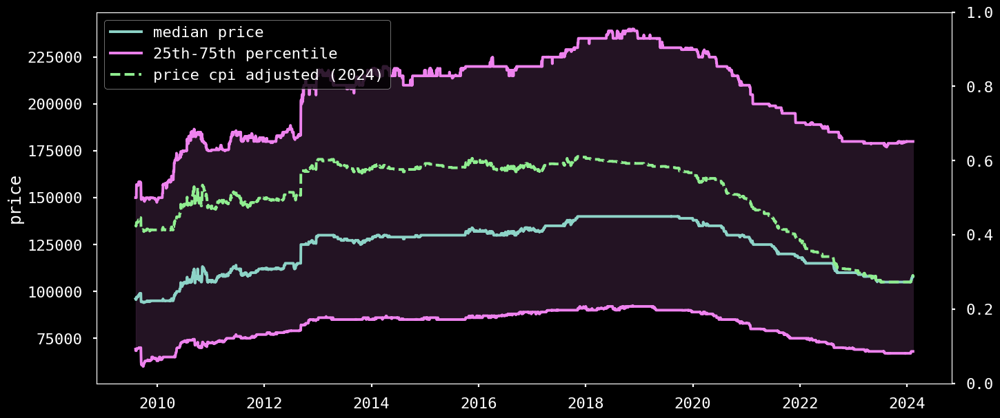

# 🧉 ARED - Argentinian Real Estate Datset


Argentina's economic history, marked by crises like the "Rodrigazo" in the 1970s, has led to the dominance of the US dollar in real estate transactions. Recent policies have further shaped the market dynamics configuring a unique scenario. ARED aims to provide quarterly snapshots of the Argentinian real estate market, including both listing features as well as images, filling a gap in available datasets.

<br/>




## Dataset Description

#### <span style="color:orange">0th edition</span>

This zeroth edition of the ARED dataset offers a snapshot of the Argentina real estate market from `2024-01-11` to `2024-02-25`, including both listing features as well as images, filling a gap in available datasets focused on Latin America. Execute the `sh` script to download the dataset, or access the below links.

Dataset consists on 2 files:
- csv file with listing features [features.csv](https://ared0.s3.amazonaws.com/ARED0.csv)
- zip file with `webp` formatted images [imgs.zip](https://ared0.s3.amazonaws.com/ARED0.tar.gz)
    - Each image is named with the property's unique identifier
    - the image folder is organized hierarchichally by the id first 2 chars
    - `00/00aabbc0dbfc65f1747add14cda036c2/1.webp`

<!-- to be added on publication -->
For more information refer to the dataset [paper](assets/ARED0.pdf).


#### <span style="color:orange">Future of ARED</span>
ARED will get updated on a quarterly basis. Historical data previous to 11th January 2024 as well as transactional data may be released.


### Citation
----
```bibtex
@misc{belenky2024ared,
      title={ARED: Argentina Real Estate Dataset}, 
      author={Iván Belenky},
      year={2024},
      eprint={2403.00273},
      archivePrefix={arXiv},
      primaryClass={cs.LG}
}
```
